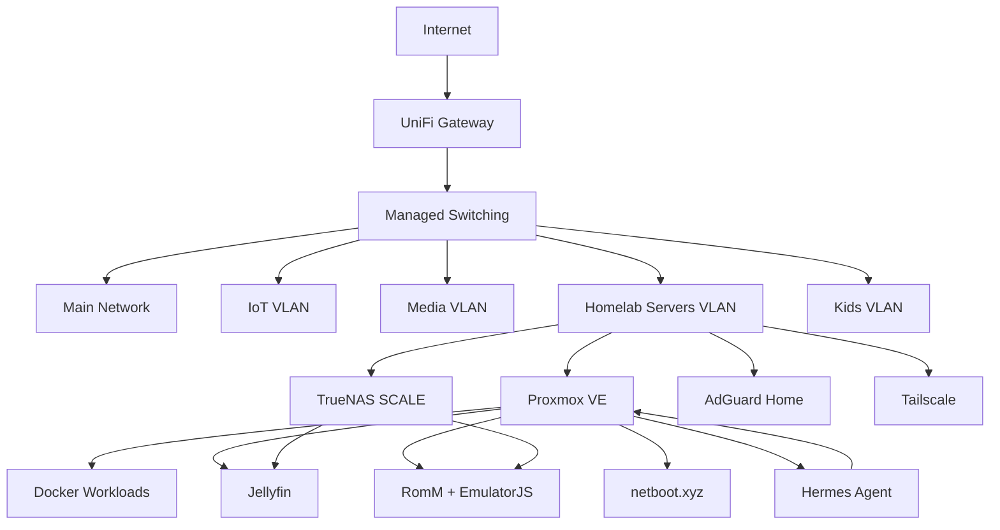

# BDLTech Homelab Showcase

> A public, sanitized look at the systems, services, automation, and recovery practices behind the BDLTech homelab.

This repository is intentionally **documentation-first**. It shows the architecture and projects without publishing live credentials, private addresses, secrets, or recovery material from the private source-of-truth repository.

## Homelab at a Glance

| Area | Platform / Service |
|---|---|
| Virtualization | Proxmox VE |
| Containers | Docker / Docker Compose |
| Networking | UniFi, managed switching, VLAN segmentation |
| DNS filtering | AdGuard Home |
| Storage | TrueNAS SCALE |
| Media | Jellyfin |
| Remote access | Tailscale |
| Game / ROM services | AMP, RomM, EmulatorJS |
| Network boot | netboot.xyz |
| AI / automation | Hermes Agent |
| Scripting | Bash, Python |

## Architecture

The diagram is intentionally logical rather than literal. Private addressing, credentials, host-specific recovery data, and security-sensitive details are omitted.

## Featured Projects

### JARVIS-style Hermes Agent appliance
A dedicated Hermes Agent VM with a custom JARVIS-inspired dashboard, read-only Proxmox telemetry, external service health monitoring, and recovery-focused customization tracking.

### Jellyfin with GPU acceleration
A Jellyfin VM with NVIDIA GPU passthrough, dedicated transcode/cache storage, and media presented from network storage.

### RomM + EmulatorJS
A virtualized ROM-management stack backed by network storage, with browser-based emulation through EmulatorJS.

### Proxmox read-only monitoring
A small helper layer designed around least privilege so automation can inspect node, guest, storage, backup, and recent-error state without receiving broad administrative access.

### Network segmentation
A VLAN-oriented design separating trusted clients, IoT, media, server workloads, and child devices while keeping DNS and service access manageable.

### Recovery-first documentation
Infrastructure changes are documented alongside recovery notes, service maps, and validation checks so the environment can be rebuilt instead of remembered.

## Design Principles

- **Read-only first** for monitoring and automation
- **Least privilege** for service accounts and tokens
- **Secrets stay out of Git**
- **Documentation is part of the deployment**
- **Repeatable recovery beats one-off fixes**
- **Public docs stay sanitized**

## Repository Guide

- [Architecture overview](docs/architecture.md)
- [Projects](docs/projects.md)
- [Security and sanitization policy](SECURITY.md)
- [Screenshot guide](assets/screenshots/README.md)

## Public vs. Private Repositories

This showcase is public by design. Operational configuration, private addressing, live recovery material, and credentials remain in a separate private repository.

## Status

This repository grows as projects are cleaned up and prepared for public documentation.

---

Built and maintained by **BDLTech**.
