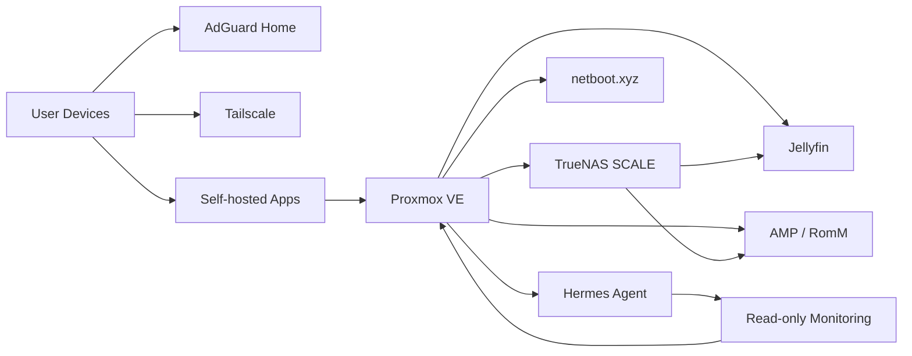

# Architecture Overview

This document describes the BDLTech homelab at a public, sanitized level.

## Logical Layers

### Edge and network

The network is built around a UniFi gateway and managed switching. Logical segmentation separates major device classes such as:

- trusted clients
- IoT devices
- media devices
- homelab servers
- child devices

Wireless and wired clients can be placed into the appropriate network segment while shared infrastructure remains centrally managed.

### Compute

Proxmox VE provides the primary virtualization layer. Workloads are split into virtual machines and containers according to isolation, hardware access, and service requirements.

Representative workloads include:

- Jellyfin
- Hermes Agent
- game server infrastructure
- RomM / EmulatorJS
- netboot.xyz
- Tailscale
- Docker-hosted applications

### Storage

TrueNAS SCALE provides shared storage for services that need larger persistent datasets, including media and ROM libraries.

Local VM disks are still used where low-latency scratch, cache, operating-system, or application-state storage makes sense.

### DNS and filtering

AdGuard Home provides network DNS filtering. Internal naming is used for homelab services, while public documentation deliberately omits the live internal namespace and private addressing scheme.

### Remote access

Tailscale provides authenticated remote connectivity into the homelab. The design favors controlled access paths rather than exposing individual management services directly to the public internet.

### Automation and observability

Hermes Agent is used as an automation and operator-assistance layer. Proxmox integration is designed around a read-only account and helper commands rather than broad administrator credentials.

## Service Relationships

## What is intentionally omitted

This public architecture does not include:

- live IP addresses
- credentials or API tokens
- private hostnames
- SSH keys
- recovery secrets
- exact firewall rule exports
- raw environment files
- authentication cookies or OAuth material
- internal-only operational procedures that would weaken security

The private source-of-truth repository contains the operational detail needed for maintenance and recovery.
