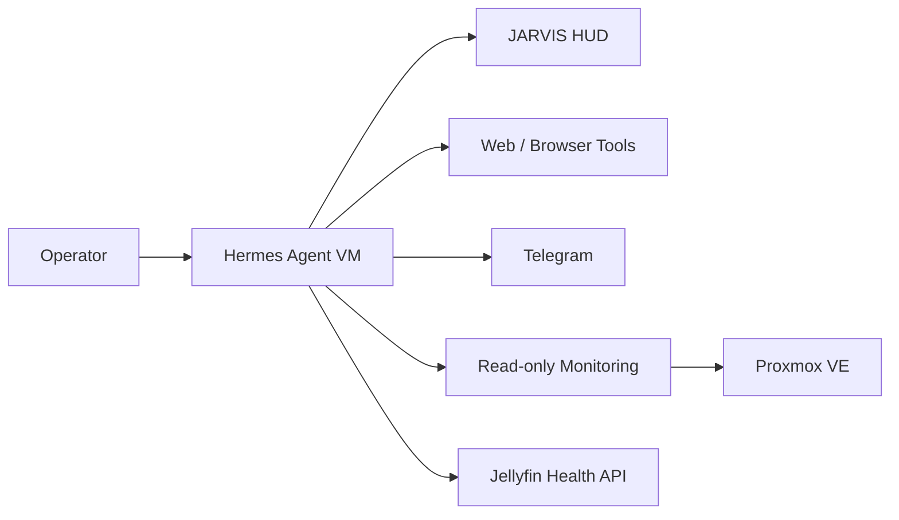
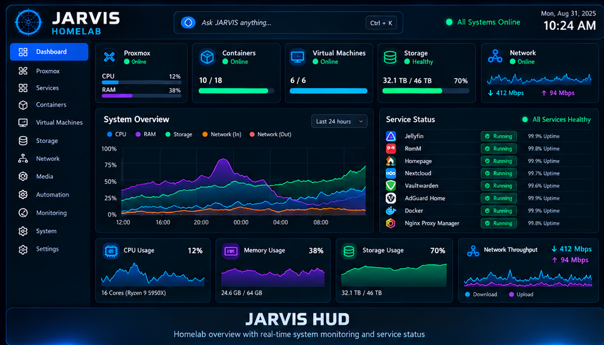

# Hermes Agent + JARVIS HUD

This page documents the public, sanitized version of the BDLTech Hermes Agent appliance.

The system is designed as an AI-assisted operator console for the homelab, with a strong preference for **read-only visibility before write access**.

## Architecture



## Platform

| Component | Design |
|---|---|
| Guest OS | Debian |
| Deployment | Dedicated VM |
| Agent | Hermes Agent |
| Interface | Web dashboard + CLI |
| Custom UI | JARVIS-inspired HUD |
| Infrastructure access | Read-only Proxmox account/helper |
| Service health | External API checks |
| Notifications | Telegram integration |
| Recovery | Customizations preserved separately from secrets |

## JARVIS HUD

The custom dashboard provides a single operational view of the homelab.

Typical panels include:

- Proxmox CPU and memory
- guest state
- storage status
- current alerts
- Hermes core status
- external service health
- Jellyfin availability
- read-only status indicators

<p align="center">
  
</p>

## Read-only Proxmox Integration

Hermes does not need broad administrator rights for routine monitoring.

A small helper exposes operations such as:

```text
version
node
guests
running
stopped
storage
recent-errors
backup-jobs
summary
health
```

The helper is intentionally limited to inspection-oriented actions.

This provides useful context to the agent without turning routine questions into privileged infrastructure operations.

## Example Operator Workflow

A typical interaction can be as simple as:

```text
How is Proxmox doing?
```

Hermes can gather a compact health view and summarize:

- node condition
- running/stopped workloads
- memory pressure
- storage utilization
- recent errors
- backup visibility

## External Service Monitoring

The dashboard can inspect services externally instead of installing monitoring code everywhere.

For example, Jellyfin availability can be checked through its public system-information endpoint.

This keeps monitoring lightweight and reduces guest-side changes.

## Secrets and Configuration

The design separates:

- reusable configuration
- custom UI files
- helper scripts
- runtime state
- credentials and tokens

Only the reusable, non-sensitive portions belong in Git.

Production environment files, OAuth material, bot tokens, and infrastructure credentials stay outside the public repository.

## Recovery Strategy

Customizations are treated as recoverable assets.

The private source-of-truth tracks:

- JARVIS HUD plugin files
- skin configuration
- helper scripts
- restoration scripts
- documentation of the working state

A rebuild should restore the base Hermes installation first, then reapply customizations without restoring stale runtime state.

## Design Principles

- read-only first
- least privilege
- explicit separation of secrets
- observable external health checks
- repeatable recovery
- operator-friendly presentation
- minimal changes to monitored systems

---

[Back to the showcase README](../README.md)
