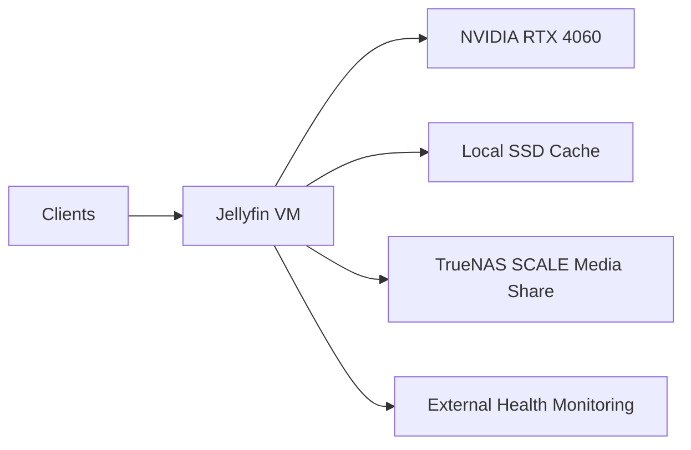

# Jellyfin Build

This page documents the public, sanitized version of the BDLTech Jellyfin deployment.

The goal of this build is a dedicated media-server VM with hardware-accelerated transcoding, fast local cache storage, and large network-backed media storage.

## Architecture



## Platform

| Component | Configuration |
|---|---|
| Hypervisor | Proxmox VE |
| Guest OS | Debian 13 |
| Workload | Dedicated Jellyfin VM |
| CPU | Host CPU passthrough |
| Memory | 10 GiB class |
| GPU | NVIDIA GeForce RTX 4060 passthrough |
| Root disk | Dedicated VM system disk |
| Transcode/cache disk | Dedicated SSD |
| Media storage | TrueNAS SCALE over SMB/CIFS |
| Monitoring | External Jellyfin API health checks |

## Why a Dedicated VM?

Jellyfin runs in its own VM rather than sharing a general-purpose Docker host.

That gives the media server:

- direct control over GPU passthrough
- clear isolation from unrelated applications
- predictable storage and cache layout
- straightforward recovery and troubleshooting
- independent package and driver management

## GPU Passthrough

The VM receives an NVIDIA GeForce RTX 4060 through PCI passthrough.

The guest uses NVIDIA drivers directly and Jellyfin uses the GPU for supported hardware video decode and encode operations.

The public repository intentionally omits host PCI addresses and low-level passthrough identifiers because those are environment-specific.

### Validation

Typical validation checks include:

```bash
nvidia-smi
```

and confirming the Jellyfin service account has access to the required render/video device groups.

During an active hardware-transcoded stream, GPU activity can also be observed with:

```bash
watch -n 1 nvidia-smi
```

## Local Transcode and Cache Storage

A dedicated SSD is mounted for Jellyfin cache and transcode workloads.

Representative layout:

```text
/var/cache/jellyfin
└── transcodes/
```

This keeps temporary transcoding activity away from the VM root filesystem and avoids placing transient writes on network storage.

Useful checks:

```bash
findmnt /var/cache/jellyfin
df -h /var/cache/jellyfin
ls -lah /var/cache/jellyfin/transcodes
```

## Media Storage

The media library is stored on TrueNAS SCALE and mounted read-only into the Jellyfin VM.

Representative layout:

```text
/mnt/media
├── Movies/
├── TV Shows/
├── Music/
└── Books/
```

The live internal server address and share path are intentionally omitted from this public repository.

A read-only media mount limits the damage Jellyfin could cause to the source library while still allowing normal library scanning and playback.

Useful checks:

```bash
findmnt /mnt/media
df -hT /mnt/media
ls -lah /mnt/media
```

## Jellyfin Service

Jellyfin is installed as a normal system service inside the Debian VM.

Basic health checks:

```bash
systemctl is-active jellyfin
systemctl status jellyfin --no-pager
```

The server can also be checked externally through Jellyfin's public system-information endpoint without modifying the guest.

This is useful for dashboard monitoring because it confirms application availability from outside the VM.

## Hardware Acceleration

Jellyfin is configured to use NVIDIA hardware acceleration for supported media formats.

The practical validation path is:

1. start playback that requires transcoding
2. confirm transcode segments are being written to the SSD cache
3. confirm Jellyfin is using the expected FFmpeg path
4. inspect GPU activity with `nvidia-smi`
5. verify playback remains stable on the client

## Recovery Checklist

After rebuilding the VM:

1. restore the Debian base system
2. restore or reinstall the NVIDIA driver
3. verify GPU passthrough inside the guest
4. recreate the dedicated cache mount
5. recreate the TrueNAS media mount
6. install Jellyfin
7. restore Jellyfin application data if required
8. verify service startup
9. verify media-library visibility
10. test direct play
11. test hardware transcoding
12. confirm cache writes and GPU activity

## Operational Checks

A quick public-safe validation set:

```bash
systemctl is-active jellyfin
nvidia-smi
findmnt /var/cache/jellyfin
findmnt /mnt/media
df -h / /var/cache/jellyfin
```

## Design Decisions

### Dedicated GPU

A dedicated RTX 4060 gives the media server predictable hardware acceleration without sharing the device with unrelated workloads.

### Dedicated Cache SSD

Transcode and metadata/cache activity stays on local high-speed storage rather than the root filesystem or NAS.

### Read-only Media Mount

The media source remains protected from accidental writes by the Jellyfin service.

### External Monitoring

Application health can be checked externally through the Jellyfin API, reducing the need for invasive monitoring agents inside the VM.

## Public / Private Boundary

This showcase intentionally does not publish:

- internal IP addresses
- SMB credentials
- mount credentials files
- API keys
- host PCI addresses
- exact firewall rules
- production Jellyfin configuration databases

Those belong in the private operational repository.

---

[Back to the showcase README](../README.md)
