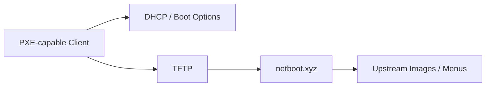

# netboot.xyz Deployment

This page documents the public, sanitized design of the BDLTech network-boot service.

## Purpose

netboot.xyz provides PXE/iPXE-based boot menus for operating-system installation, recovery, diagnostics, and other network-boot workflows.

## Architecture



## Deployment

The service runs on a dedicated Debian VM using Docker.

Typical container responsibilities include:

- TFTP boot files
- iPXE menus
- web-based management interface
- boot assets for UEFI and legacy clients

## Container Model

Representative structure:

```text
/opt/netbootxyz/
├── compose.yml
└── persistent configuration
```

The container exposes the required network-boot services and a management UI.

## Validation

Useful checks:

```bash
docker compose ps
docker compose logs --tail=100
```

Then validate from a test client:

1. enable network boot
2. confirm DHCP provides the expected boot path
3. confirm the iPXE menu loads
4. select a known-good entry
5. verify the image or installer begins loading

## Why a Dedicated VM?

A dedicated VM keeps PXE/TFTP behavior separate from unrelated Docker workloads and makes troubleshooting packet flow easier.

## Recovery Outline

1. rebuild the Debian VM
2. install Docker and Compose
3. restore the compose definition
4. restore persistent menu/configuration data
5. verify TFTP and management ports
6. test UEFI boot
7. test legacy boot if still required

## Public / Private Boundary

Live DHCP settings, private addresses, internal boot-menu customizations, and environment-specific recovery data are intentionally excluded.

---

[Back to the showcase README](../README.md)
