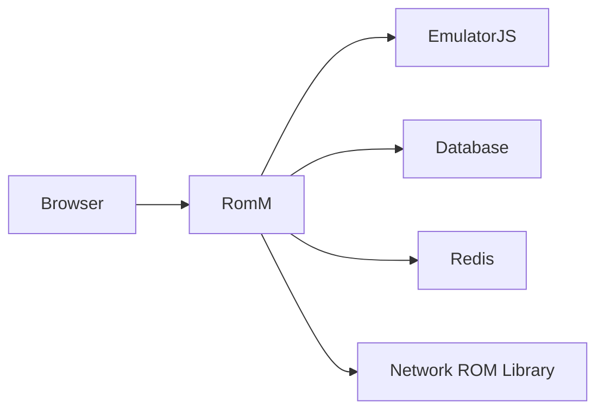
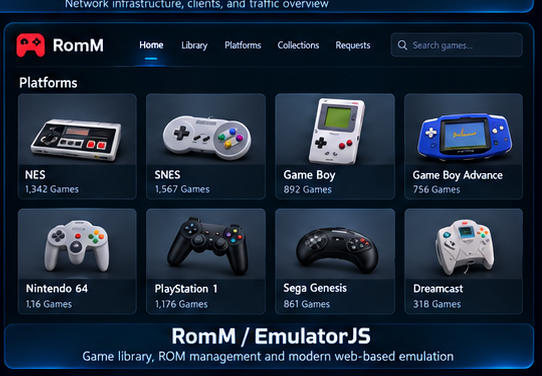

# RomM + EmulatorJS Build

This page documents the public, sanitized design of the BDLTech ROM management and browser-emulation stack.

## Architecture



## Platform

| Component | Role |
|---|---|
| Debian VM | Dedicated application host |
| RomM | ROM library management |
| EmulatorJS | Browser-based emulation |
| MariaDB | Application database |
| Redis | Cache / queue support |
| Network storage | Large ROM library |
| Browser | Playback client |

## Why a Dedicated VM?

The stack runs in a VM rather than a privileged container.

Benefits include:

- cleaner isolation
- straightforward package management
- predictable network-storage mounting
- fewer host-level permissions
- simpler recovery and migration

## Network-backed ROM Library

Large game libraries live on shared storage rather than the application disk.

Representative public-safe layout:

```text
/var/lib/romm/library/roms
```

The live SMB server address and share path are intentionally omitted.

Automounting can be used so the guest does not block startup if the storage server is temporarily unavailable.

## EmulatorJS Integration

EmulatorJS provides browser-based gameplay for supported platforms.

The application assets are integrated into the RomM frontend so games can be launched directly from the library interface.

<p align="center">
  
</p>

## Operational Validation

Useful checks include:

```bash
findmnt /var/lib/romm/library/roms
systemctl --type=service --state=running
```

Then validate from the browser by:

1. opening the RomM library
2. selecting a supported title
3. launching through EmulatorJS
4. verifying controls, audio, and save behavior

## Recovery Outline

1. restore the Debian VM
2. recreate the network-storage mount
3. restore RomM application configuration
4. restore database state if required
5. restore EmulatorJS assets
6. verify the ROM library is visible
7. test a known-good title
8. validate background workers and scheduled tasks

## Public / Private Boundary

This public page does not contain:

- live SMB credentials
- internal addressing
- full ROM inventory
- copyrighted ROM files
- production environment secrets
- database passwords

---

[Back to the showcase README](../README.md)
