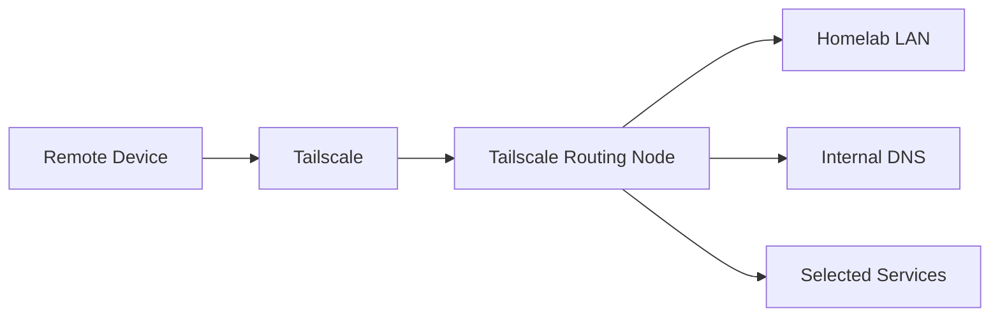

# Tailscale Remote Access

This page documents the public, sanitized design of the BDLTech Tailscale deployment.

## Purpose

Tailscale provides authenticated remote access to selected homelab resources without exposing individual management interfaces directly to the public internet.

## Architecture



## Deployment Model

The routing endpoint runs as a lightweight Linux guest.

It can provide:

- remote device access
- subnet routing
- optional exit-node service
- access to internal DNS
- controlled paths to homelab services

## Key Design Points

### Dedicated routing endpoint

Remote-access duties are isolated from application servers.

### IP forwarding

The Linux guest must be able to forward traffic between the Tailscale interface and the homelab network.

### DNS

Remote clients can use internal DNS when access to local service names is required.

### NAT only when necessary

Routing should remain as simple as possible. NAT is added only where the surrounding network design requires it.

## Troubleshooting Flow

When a remote client cannot reach the homelab, validate in this order:

1. Tailscale node is connected
2. advertised routes are approved
3. forwarding is enabled
4. the guest can reach the target LAN service
5. firewall forwarding rules allow the flow
6. return routing is correct
7. DNS works independently of routing
8. packet capture confirms where traffic stops

Useful generic checks:

```bash
tailscale status
tailscale netcheck
ip addr
ip route
sysctl net.ipv4.ip_forward
nft list ruleset
```

## Security Model

Tailscale reduces the need to publish administrative interfaces directly.

Access policy should still follow least privilege:

- only advertise required routes
- limit who can reach management services
- keep guest firewall rules explicit
- separate DNS troubleshooting from routing troubleshooting
- avoid unnecessary blanket NAT rules

## Public / Private Boundary

This repository intentionally omits tailnet identifiers, live addresses, ACL policy details, auth keys, and internal DNS names.

---

[Back to the showcase README](../README.md)
